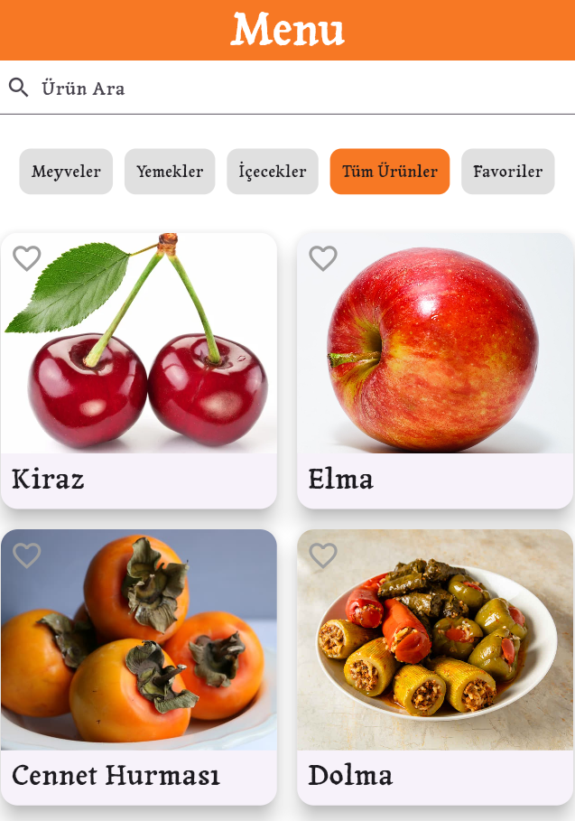
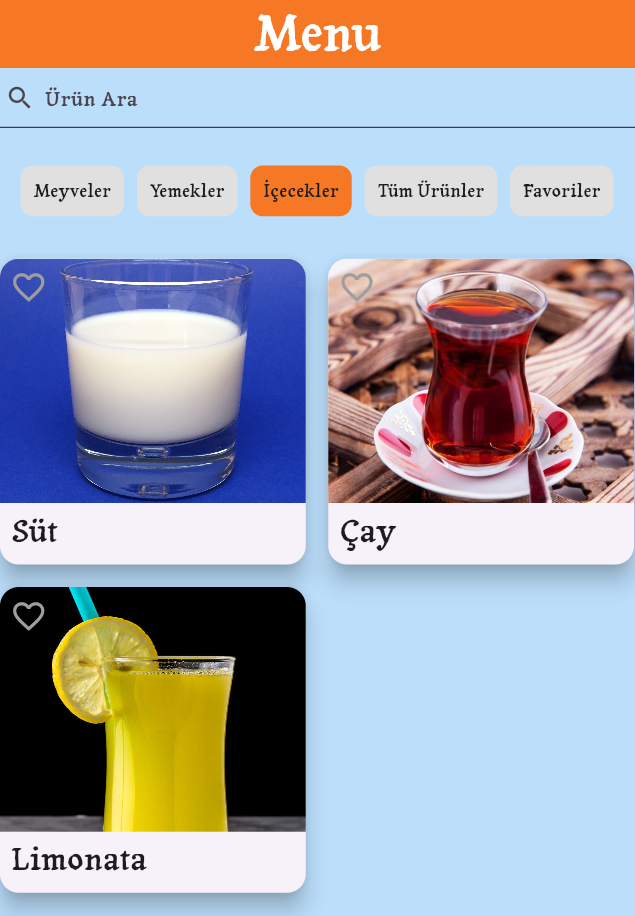
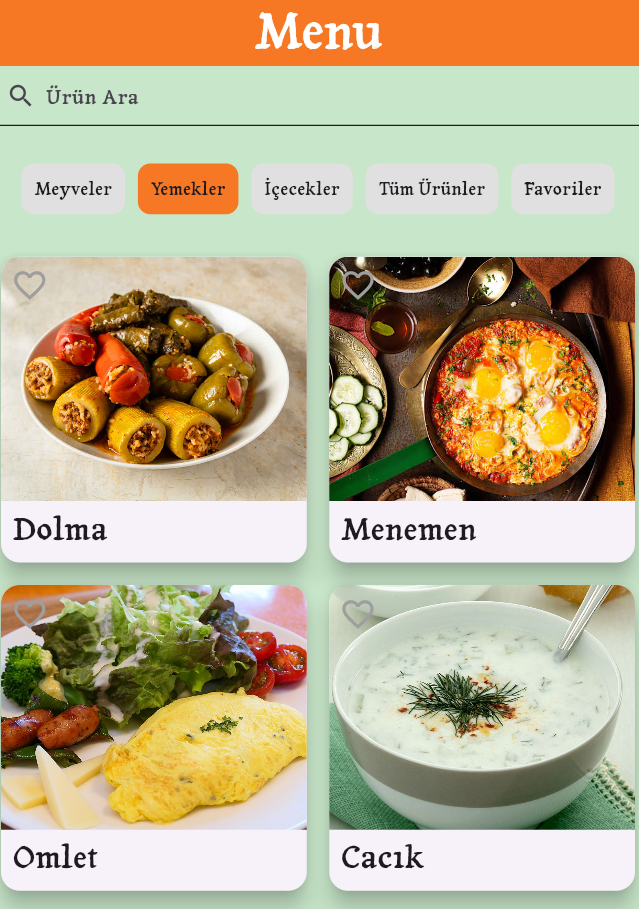
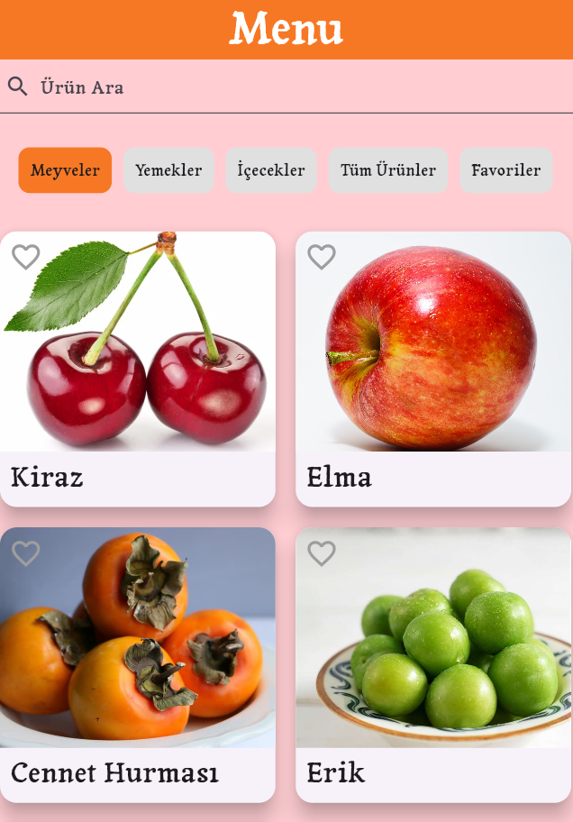
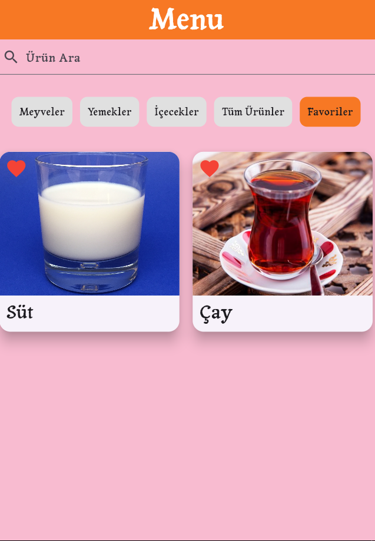
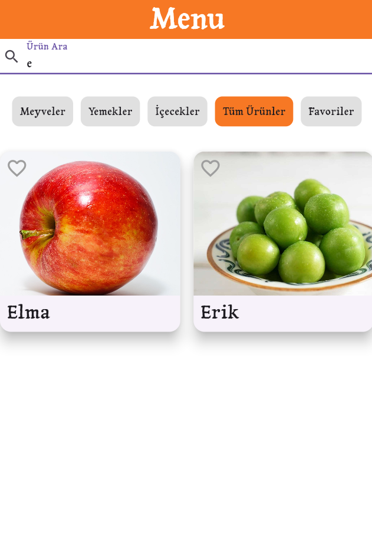

# FilterApp

FilterApp, Flutter kullanarak geliştirilmiş bir ürün filtreleme uygulamasıdır. Uygulama, kullanıcıların kategorilere göre ürünleri görüntülemesine, arama yapmasına ve favorilerine ürün eklemesine olanak tanır. Ürünler JSON formatında yüklenir ve favoriler SharedPreferences aracılığıyla saklanır.

## Özellikler

- **Ürün Filtreleme**: Meyveler, sebzeler, diğer ürünler ve favoriler gibi kategorilere göre ürünleri filtreleyebilirsiniz.
- **Favoriler**: Ürünleri favorilerinize ekleyip çıkarabilir, favorilerinizi kaydedebilirsiniz.
- **Arama**: Ürün adıyla arama yaparak ürünleri hızlıca bulabilirsiniz.
- **Dinamik Kategori Geçişi**: Kategoriler arasında geçiş yaparak istediğiniz ürünleri daha kolay keşfedin.

## Teknolojiler

- **Flutter**: Uygulama Flutter ile geliştirilmiştir.
- **SharedPreferences**: Kullanıcı verileri (favoriler) uygulama kapalı olsa bile saklanır.
- **JSON**: Ürünler ve kategoriler JSON formatında yüklendiği için veriler esnek bir şekilde yönetilebilir.

## Kullanım

Uygulama açıldığında, ürün kategorilerini seçebilir ve arama kutusuna ürün adı girerek arama yapabilirsiniz.

Ürünleri favorilerinize ekleyip çıkarabilir ve favori sekmesinde yalnızca favori ürünlerinizi görebilirsiniz.

## Ekran Görüntüleri

----------------------------------------------

----------------------------------------------

----------------------------------------------

----------------------------------------------

----------------------------------------------

----------------------------------------------
